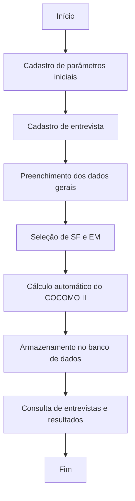

# 📊 Sistema de Entrevistas — Estimativa de Esforço COCOMO II (Early Design)

## 📌 Visão Geral

Este sistema foi desenvolvido para **coletar dados de entrevistas**, calcular métricas de tamanho de software e, com base nelas, **estimar esforço e prazo** de desenvolvimento utilizando o modelo **COCOMO II — Early Design**.

Ele permite que analistas registrem entrevistas com informações técnicas e contextuais, preencham fatores de escala (Scale Factors — SF) e multiplicadores de esforço (Effort Multipliers — EM), e obtenham como resultado:

- **Tamanho estimado em KLOC** (milhares de linhas de código)
- **Esforço total** em **Pessoa-Mês (PM)**
- **Prazo de desenvolvimento** em meses
- **Quantidade média de pessoas necessárias**

---

## ⚙️ Principais Funcionalidades

- **Cadastro de entrevistas** com:
  - Nome do entrevistado e entrevistador
  - Data da entrevista
  - Tipo de entrada (KLOC, Pontos de Função ou COSMIC)
  - Linguagem de programação ou tecnologia alvo
  - Entradas, saídas, leituras e gravações (para COSMIC)
  - Fatores de Escala (SF)
  - Multiplicadores de Esforço (EM)

- **Cálculo COCOMO II — Early Design** usando parâmetros configuráveis:
  - `A`, `B`, `C`, `D` → constantes do modelo
  - Conversões PF/COSMIC para KLOC
  - Valores e descrições dos SF e EM conforme definição do modelo

- **Configuração e customização via API**:
  - Ajuste de parâmetros do modelo (`/api/ParametrosCocomo`)
  - Inclusão/edição de conversões PF/COSMIC (`/api/ConversoesTamanho`)
  - Manutenção da tabela mestre de fatores (`/api/FatoresConversao`)

- **Consulta de resultados**:
  - Lista de entrevistas cadastradas
  - Detalhe de cada entrevista com resultados calculados

---

## 🧮 Como funciona o cálculo

O sistema segue a fórmula do **COCOMO II — Early Design**:

```
Esforço (PM) = A × (Tamanho)^B × (∏EMi)
Prazo (Meses) = C × (Esforço)^D
```

Onde:
- **A, B, C, D** → parâmetros calibráveis na tabela `ParametrosCocomo`
- **Tamanho** → em **KLOC**
- **EMi** → multiplicadores de esforço selecionados
- **∏EMi** → produto dos valores numéricos dos EM escolhidos
- **B** é ajustado conforme a soma dos Scale Factors (SF)

---

## 📑 Tipos de Entrada

Na entrevista, você seleciona como o tamanho do software será informado:

1. **KLOC (Milhares de Linhas de Código)** → Informe diretamente o valor.
2. **PF (Pontos de Função)** → Selecione a linguagem e o sistema converte automaticamente para KLOC usando a tabela `ConversoesTamanho`.
3. **COSMIC** → Informe o número de Entradas, Saídas, Leituras e Gravações; o sistema calcula o CFP (Cosmic Function Points) e converte para KLOC.

---

## 📋 Campos Específicos

### **Fatores de Escala (Scale Factors — SF)**
São 5 itens que impactam exponencialmente o esforço:
- `PREC` — Precedência do Projeto
- `FLEX` — Flexibilidade de Processo
- `RESL` — Resolução de Riscos
- `TEAM` — Coesão da Equipe
- `PMAT` — Maturidade do Processo

Cada SF possui níveis (`Muito Baixo` → `Muito Alto`) e valores numéricos definidos na tabela `FatoresConversao`.

---

### **Multiplicadores de Esforço (Effort Multipliers — EM)**
São 7 itens que ajustam linearmente o esforço:
- `RCPX` — Complexidade do Produto
- `RUSE` — Reusabilidade Requerida
- `PDIF` — Dificuldade da Plataforma
- `PERS` — Capacidade da Equipe
- `PREX` — Experiência da Equipe
- `FCIL` — Apoio de Ferramentas
- `SCED` — Pressão de Cronograma

Também possuem níveis (`Muito Baixo` → `Muito Alto`) e valores configuráveis.

---

## 🗄️ Estrutura de Tabelas (resumo)

- `Entrevistas` → Entrevistas registradas
- `ScaleFactors` → Itens SF vinculados a entrevistas
- `EffortMultipliers` → Itens EM vinculados a entrevistas
- `ParametrosCocomo` → Parâmetros A, B, C, D
- `ConversoesTamanho` → Conversões PF/COSMIC → KLOC
- `FatoresConversao` → Tabela mestre SF/EM (nome, descrição, valor)
- `Funcionalidades` e `MedicoesCosmic` → Apoio à contagem COSMIC

---

## 🚀 Como usar

1. **Cadastrar parâmetros iniciais** (`ParametrosCocomo`, `ConversoesTamanho`, `FatoresConversao`) — já existe um script de seed com valores padrão.
2. **Cadastrar uma nova entrevista** via `POST /api/Entrevistas`.
3. **Preencher dados gerais + SF + EM** no frontend.
4. **Consultar os resultados** via `GET /api/Entrevistas` ou `GET /api/Entrevistas/{id}`.
5. **Ajustar parâmetros** a qualquer momento para recalcular projeções.

---

## 📌 Observações

- Todos os valores numéricos de SF e EM são **configuráveis** via API, permitindo adaptar o modelo à sua realidade.
- O sistema não exige autenticação na versão inicial.
- A conversão PF/COSMIC para KLOC depende da tabela `ConversoesTamanho`.

---

## 🔄 Fluxograma de Funcionamento



---
